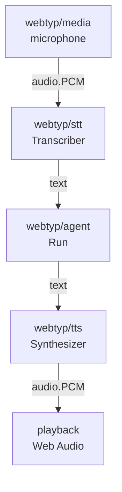

# Architecture — `webtyp/audio`

## What this is

The one type that represents sound in the webtyp ecosystem: `audio.PCM`. **PCM**
(pulse-code modulation) is uncompressed audio, a list of amplitude values sampled many times
per second.

You meet it when audio moves between pieces: from the microphone (`webtyp/media`) into
speech-to-text (`webtyp/stt`), or from text-to-speech (`webtyp/tts`) to the speakers.

It exists so that those pieces agree on one shape instead of converting between their own.

## The voice pipeline (version 2)

Version 1 of the agent is text only. The pipeline below is the target of version 2. Its
contracts are declared now so that it is wired from the start.

## Representation

- `float32` samples in [-1, 1]: the Web Audio API delivers and plays exactly this.
- Interleaved channels (L, R, L, R…) in one slice: one allocation, the common layout of
  PortAudio and miniaudio.
- Speech models expect **16 kHz mono**. Browser microphones deliver 44.1 or 48 kHz.
  Converting is resampling (version 2, below).

## Version 2 work

These pieces have no plan yet. Where each one belongs is an open decision in the
[ecosystem master plan](https://github.com/webtyp/agent/blob/main/docs/AGENT_ECOSYSTEM_MASTER_PLAN.md).

| Piece | What it does |
|---|---|
| resampling | 48 kHz → 16 kHz for speech models, and back for playback |
| voice activity detection (VAD) | tells when the person starts and stops talking, so only speech is transcribed |
| playback queue | plays synthesized chunks back to back through Web Audio, without gaps |
